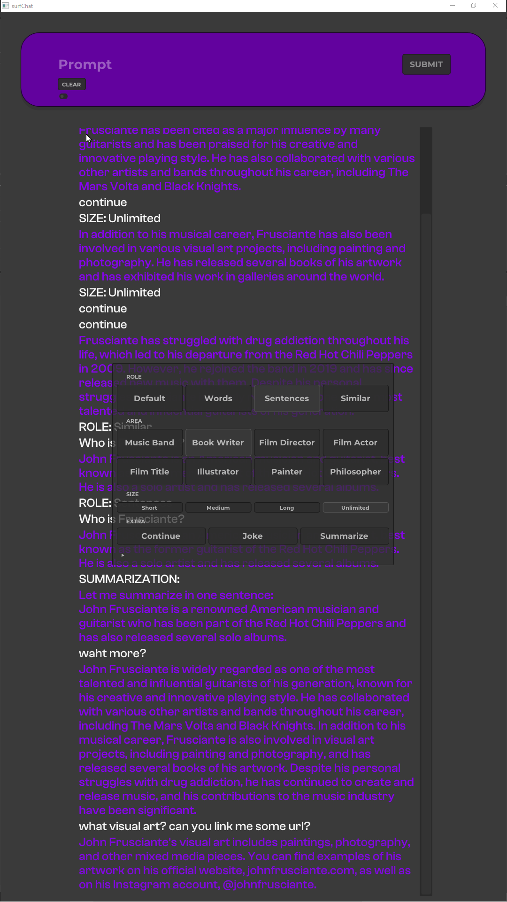

# WIP / IN DEVELOP...

# SurfChat

# OVERVIEW

_A **guided** and categorized **conversation assistant** powered by **ChatGPT** and other **LLM engines**.  
Designed to dive into different types of **creators** or artists,  
as well as **explore** other similar or **related** ones._  

## SCREENSHOT
 

## SCREENSHOTS AND VIDEO

[INSTAGRAM POST](https://www.instagram.com/p/Cu9Iy05OdpC/?utm_source=ig_web_copy_link&igshid=MzRlODBiNWFlZA==)

# FEATURES

- Prompt text input box.
- Clickable floating menu.
- Text-to-speech response reader.

## REQUERIMENTS

* [ofxChatGPT](https://github.com/moebiussurfing/ofxChatGPT) / FORK
  * Requires a paid **OpenAI** account to use the **ChatGPT API**,
  * Or other alternative/custom servers as could be [Pawan.Krd](https://patreon.com/pawanosman?utm_medium=clipboard_copy&utm_source=copyLink&utm_campaign=creatorshare_fan&utm_content=join_link).
* [ofxElevenLabs](https://github.com/moebiussurfing/ofxElevenLabs)
  * Requires to register at least a free account.
* [ofxSurfingHelpers](https://github.com/moebiussurfing/ofxSurfingHelpers)  
* [ofxSurfingImGui](https://github.com/moebiussurfing/ofxSurfingImGui)  
* [ofxImGui](https://github.com/Daandelange/ofxImGui/) / FORK 
* [ofxWindowApp](https://github.com/moebiussurfing/ofxWindowApp)
* ofxGui / OF CORE

  
TESTED SYSTEMS

  

  - **Windows 10** / **VS 2022** / **OF ~0.11**
  

## Author
An add-on by **@moebiusSurfing**  
*( ManuMolina ) 2023*  

### CONTACT / FOLLOW

<a href="mailto:moebiussurfing@gmail.com" target="_blank">Email</a> |
<a href="https://twitter.com/moebiusSurfing/" rel="nofollow">Twitter</a> | 
<a href="https://www.youtube.com/moebiusSurfing" rel="nofollow">YouTube</a> | 
<a href="https://www.instagram.com/moebiusSurfing/" rel="nofollow">Instagram</a> | 
<a href="https://github.com/moebiussurfing" target="_blank">GitHub</a> 

### License
MIT License
